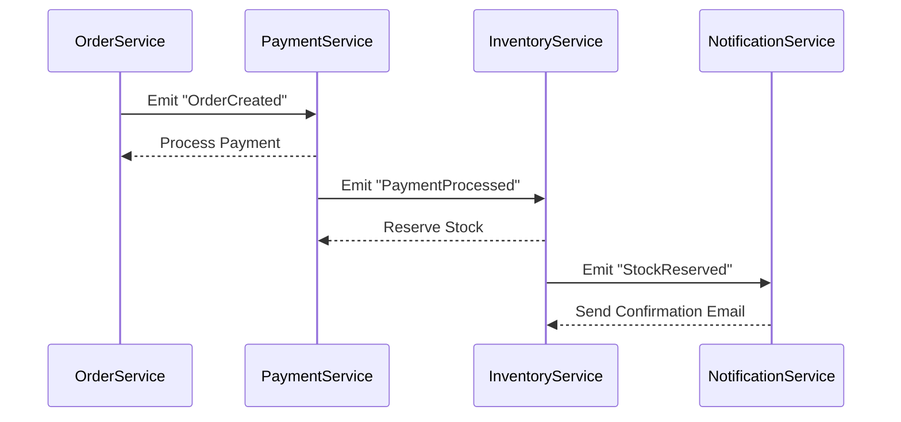

# Orchestrator-Based Saga in Node.js
This repo demo Orchestrator-Based Saga in Node.js

## Introduce

In a Choreography-Based Saga, each service is autonomous and communicates through events. There is no central orchestrator. Services listen for specific events, perform their operations, and emit subsequent events to continue the workflow. This decentralized approach works well for simpler workflows and reduces bottlenecks caused by a central orchestrator.

## Scenario: 
E-commerce Order Management System. We will use the same example as before, where a customer places an order, and multiple services handle the transaction:

- `Order Service`: Creates an order and emits an OrderCreated event.
- `Payment Service`: Listens to the OrderCreated event, processes the payment, and emits a PaymentProcessed or PaymentFailed event.
- `Inventory Service`: Listens to PaymentProcessed, reserves stock, and emits a StockReserved or StockUnavailable event.
- `Notification Service`: Listens to StockReserved to send a confirmation email.

## Diagram:

